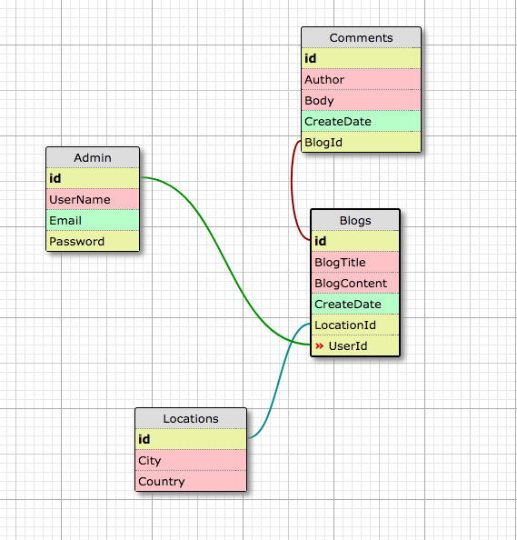

# Wander the Edge

## By Lois Choi

#### _Travel Blog in .Net., 11.02.2017_


## Description

_This site is a personal travel blog that includes travel tips, travel planning tools, videos/photos, and blog entries.
Users can create an account to save liked entries, view instagram photos from my travels, add specific destinations and activities to their travel itinerary,
see the budget needed (using the currency converter API) for specific places, and so on. The goal of this application is to extend its functionality to allow
users to book flights using the SkyScanner API and book hotels/airbnb._

### MVP
|| Behavior  | Input  | Output  |
|---|---|---|---|
|1| User may view the most recent 3 posts on the home page | Home view  | Displays top 3 posts |
|2| User may select from navbar destination, in destination view users can select form navbar travel tips, travel guide, experiences | Click specific `Destination`| View displays recent posts, top posts |
|3| User may click view instagram image on the site, click image and be led to instagram page with specific post | hover over image, see how many likes/comments | click image and be redirected to instagram to view post details|
|4| User may read post, convert my budget to their currency | click convert currency | view budget in their currency |
|5| User may leave a comment on a post | Leave Comment | Comment is stored |
|6| Site admin can add, edit, delete posts | Click `Add` or `Edit` or `Delete`  | View displays proper form |
|7| User may create an account to save liked posts | Click `Save` | Pop up lets them know it has been saved - can continue reading or go to saved view |
|8| Provide link to Expedia and/or AirBnb to book flight | Click link | Leads to corresponding website |

### Further Exploration:
|| Behavior  | Input  | Output  |
|---|---|---|---|
|1| User may create personal itineraries by adding destination and activities to their itinerary via click | Click `Add` | Pop up lets them know it has been saved - can continue reading or go to itinerary view |
|2| User can book flights/hotels after completing an itinerary | Click `Book Flight` or `Book Hotel` | Leads to showing all flights via SkyScanner API or hotels via AirBnb or Expedia |
|3| Incoporate user roles https://msdn.microsoft.com/en-us/library/t32yf0a9.aspx | User can create an acct and log in | User can save posts, add comments, edit profile |

### Technical Specs

|| Behavior  |
|---|
|1| Blog entries should be properly stored in the database | 
|2| Instagram API should be working properly | 
|3| Reviews content should be between 50 and 250 character (an error message should show if it is not)| 
|4| Incorporate SASS, CSS grids


## Known Bugs
None

## SQL Design




## Setup/Installation Requirements

* _Download and install [.NET Core 1.1 SDK](https://www.microsoft.com/net/download/core)_
* _Download and install [Mono](http://www.mono-project.com/download/)_
* _Download and install [MAMP](https://www.mamp.info/en/)_
* _Set MySQL Port to 8889_
* _Clone repository_

##### Setup/Installation for Database
* In your terminal, navigate to the project folder (where WanderTheEdge.csproj)
* Enter `dotnet restore` in the command line
* Enter `dotnet ef database restore` in the commande line

##### Import from the Cloned Repository
* _Click 'Open start page' in MAMP_
* _Under 'Tools', select 'phpMyAdmin'_
* _Click 'Import' tab_
* _Choose database file (from cloned repository folder)_
* _Click 'Go'_

## Technologies Used
* _C#_
* _.NET_
* _MVC_
* _Entity Framework_
* _[Bootstrap](http://getbootstrap.com/getting-started/)_
* _[MySQL](https://www.mysql.com/)_

### License

Copyright (c) 2017 **_Lois Choi**

*Licensed under the [MIT License](https://opensource.org/licenses/MIT)*


### ASP.Net
#### Add Packages
* Microsoft.AspNetCore.Mvc - Version 1.1.2
* Microsoft.EntityFrameworkCore - Version 1.1.2
* Pomelo.EntityFrameworkCore.MySql - Version 1.1.2
* Microsoft.AspNetCore.StaticFiles - Version 1.1.2
* Microsoft.AspNetCore - Version 1.1.2

### Migration
#### Add Packages
* Microsoft.EntityFrameworkCore.Design - Version 1.1.2

#### Add to .csproj
```
<ItemGroup>
  <DotNetCliToolReference Include="Microsoft.EntityFrameworkCore.Tools.DotNet" Version="1.0.0" />
</ItemGroup>
```
If missing, add:
```
<ItemGroup>
  <PackageReference Include="Microsoft.EntityFrameworkCore.Design" Version="1.1.2" />
</ItemGroup>
```

#### Commands in terminal or VS Package Console (Windows only)
* Right click on solution file, `Build` project
* `Start Server` in MAMP
* `dotnet restore` (keep running restore if you come across errors)
* `dotnet ef migrations add Initial` (Initial can be any name of your migration, like a commit message)
* `dotnet ef database update`
